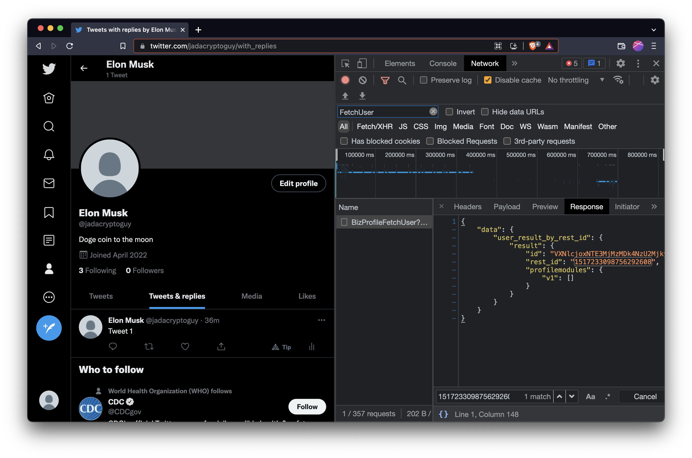

# Twitter Garbage Collection

This repository contains scripts which can be used to perform a cleanup of your Twitter account. It deletes all the tweets and replies till date and unfavorites all your liked tweets.

## How to use:

You would need to update the following variables in the script to make it work. These are unique for each user and hence no way to automate this (actually there is but I'm lazy).

- `userid`
- `tweets_url`
- `delete_url`
- `likes_url`
- `unfavourite_url`
- `cookies`
- `headers`

Follow the following steps:

- Go to https://twitter.com and login. Preferrably use a chromium based browser to follow the exact steps.
- Visit you profile and open developer tools.
  
- Click on "Tweets & Replies" tab. In the devtools, go to "Network" ta and search for "UserTweetsAndReplies".
- Copy the url and use it as as `tweets_url`. You only need to copy the first part of the url. It should look something like "https://twitter.com/i/api/graphql/dfskhgdkbgksdbk/UserTweetsAndReplies"
  
- Similary get `likes_url` by going to the "Likes" tab and searching for "likes" in the Network tab.
- Get `delete_url` by deleting one of your tweets and searching for "Delete" in the Network tab.
- Get `unfavourite_url` by un-favouriting one of your tweets and searching for "Unfavourite" in the Network tab.
- Get `userid` by searching for "FetchUser" in Networks tab and looking at the response. The "rest_id" in response is your `userid`.
  
- Use the "Copy as cURL" option to copy the request.
  
- Use https://curlconverter.com/ to convert the cURL command to python code and from there you can get `cookies` and `headers`.
